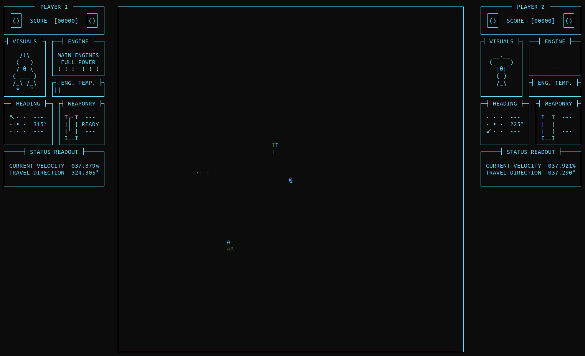
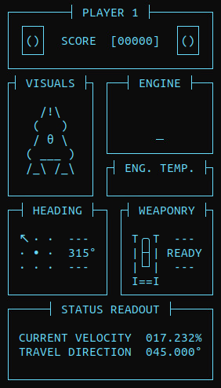

# Spacewar!
 A clone of the 1962 game "Spacewar!" using text based graphics (ASCII plus box-drawing characters).

 
 
<em>An example game, player 1 <code>A</code> has their engines active, while player 2 <code>T</code> has just fired their torpedo. There is a blackhole <code>@</code> in the center of the game screen.</em>

## Running
 Compilation is handled by the makefile, `make` will compile and run, while `make c` or `make r` will do each separately.
 If you are compiling manually without the makefile, remember to link `-lncursesw` and `-lm`.

 When running the game, please fullscreen the terminal before entering the make command, it needs to be at least 168x51 characters or the game won't display properly.

## Playing
 Due to limitations of ncurses, the controls are tap or toggle based rather than hold down. Engines are toggle on/off, while turning requires taps.
 
 Pausing, unpausing, and selecting an option in the menu are all performed using the <kbd>↵ Enter</kbd> key.
 
 |    Action     | Player 1 (`A`) | Player 2 (`T`) |
 |:-------------:|:--------------:|:--------------:|
 | Toggle Engine |  <kbd>w</kbd>  |  <kbd>↑</kbd>  |
 | Rotate Left   |  <kbd>a</kbd>  |  <kbd>←</kbd>  |
 | Rotate Right  |  <kbd>d</kbd>  |  <kbd>→</kbd>  |
 | Fire Torpedo  |  <kbd>s</kbd>  |  <kbd>↓</kbd>  |

 You gain 250 points by hitting the enemy ship with a torpedo, and lose 50 if you die by colliding with a torpedo, black hole, or the other ship.
 You win if you reach 1000 points, or if your opponent reaches -1000.

 Your ship's engines will heat up while in use, and cool down while not it use. If your engine overheats it will be unusable until it has cooled down all the way.

### HUD

 
  
 - The visuals box contains a pictoral view of your ship, with animations if your engines are on and if your torpedo is ready to fire, both of which can also be seen in their own separate boxes as well.
 - The engine and engine temperature boxes show whether your engine is on and whether it is overheating respectively.
 - The heading box shows what direction your ship is actually facing, for the purpose of engine thrust and firing torpedoes, not to be confused with what direction you ship is currently travelling in, which is shown at the bottom of the HUD.
 - The weaponry box shows whether your torpedo has reloaded and is ready to fire, with an animation when it is almost ready.

 Player 1 is represented by an `A`, while player 2 is represnted by a `T`, on the HUD the visuals are designed to look like these letters.
